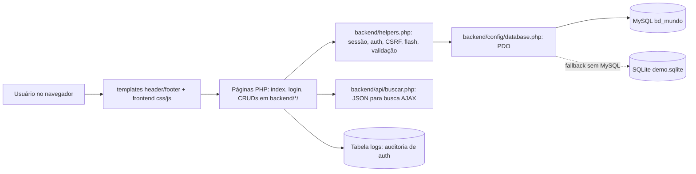

# CRUD Mundo — Sistema de gerenciamento de países, cidades, continentes e governantes

> **Projeto:** CRUD Mundo — aplicação web (front end + back end + banco de dados) para gerenciar informações geográficas do mundo.
> **Disciplina:** Programação Web · **Curso:** Desenvolvimento de Sistemas — São José dos Campos

---

## Sobre o projeto

O CRUD Mundo é um sistema web que centraliza o cadastro e a consulta de **continentes, países, cidades e governantes** em um único lugar, com dados relacionados e consistentes. O sistema implementa as quatro operações do **CRUD** (Create, Read, Update, Delete) para as quatro entidades, com autenticação por sessão e painel inicial com estatísticas.

| Entidade | Campos | Relacionamentos |
|---|---|---|
| **Continentes** | nome, população, área (km²), total de países | possui vários países (1:N) |
| **Países** | nome, população, área (km²), idioma, clima, regime político, moeda | pertence a um continente; tem um governante; possui várias cidades |
| **Cidades** | nome, população, área (km²), clima, data de fundação | pertence a um país; pode ter um governante |
| **Governantes** | nome, partido, nascimento, idade, início e fim do mandato | governa um país **ou** uma cidade |

## Problema

Manter informações geográficas espalhadas (listas soltas, planilhas ou cadastros isolados) gera duplicidade, vínculos quebrados (ex.: cidade sem país, país sem continente) e exclusões perigosas que deixam dados "órfãos". O projeto resolve isso com um cadastro relacional único, com chaves estrangeiras, validações no front end e no back end, e regras claras de integridade referencial.

## Objetivos

**Objetivo geral:** disponibilizar uma aplicação web funcional para cadastrar, listar, editar e excluir continentes, países, cidades e governantes com integridade referencial e experiência de uso simples.

**Objetivos específicos:**

- Modelar o banco `bd_mundo` com PKs, FKs e dados iniciais de demonstração.
- Implementar CRUD completo das 4 entidades com PDO e prepared statements.
- Proteger as rotas com autenticação por sessão, troca obrigatória de senha no primeiro acesso e bloqueio após 3 tentativas inválidas.
- Oferecer busca dinâmica, filtro instantâneo, validações JS + PHP e estatísticas no painel inicial.

## Funcionalidades

### Implementado

Confirmado por leitura do código em `index.php`, `login.php`, `logout.php`, `backend/`, `templates/` e `frontend/`:

- Cadastrar, listar, editar e excluir as **4 entidades** (`backend/continentes/`, `backend/paises/`, `backend/governantes/`, `backend/cidades/` — cada uma com `index.php`, `form.php`, `excluir.php`).
- Filtro instantâneo nas listagens (JavaScript — `frontend/js/app.js`).
- Validação de formulários no **front end** (JS) e no **back end** (PHP — `backend/helpers.php`: `obrigatorio()`, `numero()`, `inteiro()`, `dataOpcional()`).
- Modal de **confirmação de exclusão** (`templates/footer.php` + `app.js`, formulários com `data-confirmar`).
- Mensagens de feedback (flash via sessão, padrão Post/Redirect/Get).
- Idade do governante calculada automaticamente a partir da data de nascimento (JS).
- **Integridade referencial:** excluir continente com países e excluir país com cidades é **bloqueado** (`ON DELETE RESTRICT` + verificação em PHP); excluir governante é **permitido** e apenas desvincula (`ON DELETE SET NULL`).
- Autenticação por sessão com logout e proteção das páginas (`login.php`, `logout.php`, `exigirAutenticacao()`).
- Bloqueio persistente da conta após 3 tentativas consecutivas de senha inválida (colunas `tentativas_falhas`/`bloqueado` em `usuarios`).
- Troca obrigatória de senha no primeiro acesso (`primeiro_acesso`) e alteração voluntária (`backend/auth/senha.php`).
- Auditoria de autenticação e alteração de senha na tabela `logs` (sem gravar senha ou hash).
- Proteção CSRF nos formulários POST e escaping de saída HTML (`e()`).
- Busca dinâmica global (AJAX) de países e cidades (`backend/api/buscar.php` + `fetch()` no `app.js`).
- Estatísticas no painel inicial (`index.php`): cidade mais populosa, cidades por continente, cidade mais populosa de cada país.

### Em desenvolvimento

Nenhum item em desenvolvimento foi identificado no código atual — todo o escopo acima está implementado.

### Planejado

- Adicionar prints das telas principais (início, listagem, formulário, modal de exclusão) a esta documentação após rodar o projeto — pendência herdada da documentação anterior, não é funcionalidade de código.

## Tecnologias utilizadas

Somente tecnologias com uso confirmado no repositório:

- **Front end:** HTML5 semântico, CSS3 (responsivo, sem frameworks), JavaScript vanilla (sem frameworks).
- **Back end:** PHP 8+ com **PDO** (prepared statements em todas as queries).
- **Banco de dados:** MySQL/MariaDB (`bd_mundo`, script em `database/bd_mundo.sql`); SQLite local apenas como **modo demonstração** automático (`database/demo.sqlite`, gerado em tempo de execução quando o MySQL não está disponível).
- **Versionamento e documentação:** Git + GitHub, Markdown em `docs/`.

Não são utilizados frameworks PHP/JS, ORM, ML Engine, CI/CD ou qualquer outro componente além dos listados acima.

## Arquitetura

Arquitetura real do repositório (sem componentes inventados):



Responsabilidades:

- **Interface (`templates/`, `frontend/`):** layout compartilhado, visual responsivo, interações JS (modal, filtro, busca, validações).
- **Páginas e CRUDs (`index.php`, `login.php`, `logout.php`, `backend/continentes|paises|governantes|cidades/`, `backend/auth/senha.php`):** regras de apresentação, formulários, listagens com `LEFT JOIN`, exclusões com verificação prévia.
- **Apoio (`backend/helpers.php`):** sessão segura, autenticação, CSRF, flash, leitura de POST, validações, formatação.
- **API interna (`backend/api/buscar.php`):** endpoint JSON simples (países e cidades por nome) consumido pelo `fetch()` — não é uma API pública externa.
- **Banco (`database/bd_mundo.sql`, `backend/config/semente.php`):** esquema MySQL de entrega + seed idêntico para o modo demonstração SQLite.
- **Documentação de construção (`docs/ETAPA1.md`, `ETAPA2.md`, `ETAPA3.md`):** como o sistema foi construído em 3 etapas.

## Estrutura do projeto

A pasta real deste projeto no repositório é `PW-5-CRUD!/`. Ao copiar para o `htdocs` do XAMPP, sugere-se renomeá-la para `crud-mundo` (os exemplos de URL abaixo usam esse nome).

```
PW-5-CRUD!/
├── index.php                  ← painel inicial (dashboard + estatísticas, exige login)
├── login.php / logout.php     ← autenticação e encerramento da sessão
├── database/
│   └── bd_mundo.sql           ← script de criação do banco + dados iniciais (MySQL)
├── backend/
│   ├── helpers.php            ← funções comuns (sessão, auth, CSRF, flash, validação…)
│   ├── config/
│   │   ├── database.php       ← conexão PDO (MySQL; fallback SQLite demo)
│   │   └── semente.php        ← seed usado apenas no modo demonstração
│   ├── auth/senha.php         ← troca obrigatória ou voluntária de senha
│   ├── api/buscar.php         ← endpoint JSON da busca dinâmica
│   ├── continentes/           ← index.php, form.php, excluir.php
│   ├── paises/                ← index.php, form.php, excluir.php
│   ├── governantes/           ← index.php, form.php, excluir.php
│   └── cidades/               ← index.php, form.php, excluir.php
├── frontend/
│   ├── css/style.css          ← todo o visual (responsivo)
│   └── js/app.js              ← validações, modal, filtro, busca dinâmica…
├── templates/
│   ├── header.php             ← topo, menu, busca global, dados da sessão
│   └── footer.php             ← rodapé, faixa demo, modal de exclusão
└── docs/
    ├── ETAPA1.md              ← fundação: banco, PDO, CRUD de continentes
    ├── ETAPA2.md              ← núcleo relacional + integridade
    └── ETAPA3.md              ← interface, JS, busca, estatísticas, entrega
```

## Requisitos

- **XAMPP** (Apache + MySQL/MariaDB) **ou** PHP 8+ com extensões `pdo_mysql` (uso real) e `pdo_sqlite` (apenas modo demonstração) + MySQL/MariaDB.
- Navegador moderno com JavaScript habilitado (busca AJAX, modal, filtro).
- Acesso ao phpMyAdmin (ou cliente MySQL) para importar `database/bd_mundo.sql` no modo com MySQL.
- Para o modo demonstração rápido (sem banco): apenas PHP (o sistema cria o SQLite automaticamente).

## Como executar

> Comandos verificados por leitura do repositório. Neste ambiente de auditoria o interpretador PHP não estava instalado, portanto a execução não pôde ser rodada aqui — os passos abaixo reproduzem o fluxo documentado e coerente com `backend/config/database.php` e `docs/`.

### Windows (XAMPP)

1. Instale o **XAMPP** e inicie **Apache** + **MySQL**.
2. Copie a pasta do projeto para `C:\xampp\htdocs\crud-mundo`.
3. Abra o **phpMyAdmin** (http://localhost/phpmyadmin) e **importe** o arquivo `database/bd_mundo.sql` (ele cria o banco e já insere dados de exemplo).
4. Se necessário, ajuste usuário/senha em `backend/config/database.php` (padrão XAMPP: `root` sem senha).
5. Acesse: **http://localhost/crud-mundo/**

### Primeiro acesso

O SQL inclui uma conta inicial **apenas para demonstração**:

| Usuário | Senha inicial |
|---|---|
| `admin` | `Mundo@123` |

Essa senha existe apenas para permitir o primeiro login e **deve ser trocada** na tela obrigatória. O banco armazena somente o hash produzido por `password_hash()`.

### Linux (XAMPP)

```bash
# 1. Baixe o instalador em apachefriends.org e instale:
chmod +x xampp-linux-x64-*.run && sudo ./xampp-linux-x64-*.run

# 2. Inicie os serviços:
sudo /opt/lampp/lampp start

# 3. Copie o projeto para o htdocs (no Linux o XAMPP fica em /opt/lampp):
sudo cp -r PW-5-CRUD! /opt/lampp/htdocs/crud-mundo
sudo chmod -R 755 /opt/lampp/htdocs/crud-mundo

# 4. Importe o banco em http://localhost/phpmyadmin (botão Importar → database/bd_mundo.sql)
# 5. Acesse: http://localhost/crud-mundo/
```

### Linux (sem XAMPP — modo demonstração rápido)

```bash
# Ubuntu/Debian — instala só o PHP:
sudo apt install php-cli php-sqlite3

# Roda direto (sem banco: entra o "modo demonstração" automático com SQLite):
cd crud-mundo && php -S localhost:8000
# Acesse: http://localhost:8000

# Para usar MySQL/MariaDB de verdade:
sudo apt install php-mysql mariadb-server
sudo mysql < database/bd_mundo.sql
```

> ⚡ **Modo demonstração:** se o MySQL não for encontrado, o sistema cria automaticamente um banco SQLite local (`database/demo.sqlite`, ignorado pelo Git) com os mesmos dados — útil para uma pré-visualização rápida (os dados de verdade ficam no MySQL da entrega). A conta `admin` também é criada no SQLite e exige troca da senha no primeiro acesso.

### Ordem de inicialização

1. Suba o banco (MySQL via XAMPP/MariaDB) **ou** use o modo demonstração (sem banco).
2. Importe `database/bd_mundo.sql` quando usar MySQL.
3. Sirva o projeto via Apache (XAMPP) ou `php -S`.
4. Faça login com `admin` → troque a senha obrigatória → use o dashboard e os CRUDs.

## Configuração

- Banco MySQL (entrega): constantes no topo de `backend/config/database.php` — `DB_HOST` (padrão `127.0.0.1`), `DB_PORT` (`3306`), `DB_NAME` (`bd_mundo`), `DB_USER` (`root`), `DB_PASS` (vazio no padrão XAMPP). Ajuste conforme o ambiente; **não versione credenciais reais** nem arquivos `.env` com segredos (o `.gitignore` já os ignora).
- Modo demonstração: não requer configuração — o arquivo `database/demo.sqlite` é criado automaticamente e está no `.gitignore`.
- Sessão: nome `crud_mundo_session`, cookies `HttpOnly`/`SameSite=Lax` (ver `backend/helpers.php`).
- Fuso horário: `America/Sao_Paulo` (definido em `database.php`).

## Modelagem e integridade referencial

```
continentes 1 ─── N paises 1 ─── N cidades
governantes 1 ─── N paises      governantes 1 ─── N cidades
```

| Ação | Regra | Justificativa |
|---|---|---|
| Excluir continente com países | **Bloqueada** (`RESTRICT` + verificação em PHP) | evita países "órfãos" |
| Excluir país com cidades | **Bloqueada** (`RESTRICT` + verificação em PHP) | o usuário é avisado para excluir as cidades antes |
| Excluir governante | **Permitida** (`SET NULL` nas FKs) | país/cidade ficam sem governante, sem perder dados |

> 💡 Para comportamento em cascata, basta trocar `ON DELETE RESTRICT` por `ON DELETE CASCADE` na FK `fk_cidades_pais` (arquivo `database/bd_mundo.sql`).

## Autenticação e segurança

- Todas as páginas do dashboard e dos quatro CRUDs exigem sessão autenticada.
- Após três senhas consecutivas incorretas, a conta é bloqueada no banco e não pode entrar novamente, mesmo com a senha correta.
- Um login correto antes do terceiro erro zera o contador de tentativas.
- Enquanto `primeiro_acesso` estiver ativo, qualquer acesso direto às URLs do sistema redireciona para a troca de senha.
- Senhas verificadas com `password_verify()` e armazenadas com `password_hash()`; nenhum hash ou senha é gravado em `logs`.
- Formulários POST usam token CSRF armazenado na sessão e as saídas HTML passam por escaping.
- Para testar o fluxo: faça três tentativas inválidas com `admin`, confirme o bloqueio; recrie o banco demo ou limpe a conta para testar o primeiro acesso; depois altere a senha e valide acesso normal, logout e novo login.

## Testes

Não há testes automatizados no repositório (nenhum diretório ou arquivo de testes foi encontrado). A validação é feita por **roteiros manuais** documentados em `docs/`:

- **Etapa 1** (`docs/ETAPA1.md`): importar o SQL; cadastrar/editar/excluir continente; nome repetido (erro amigável); excluir continente com países (bloqueio).
- **Etapa 2** (`docs/ETAPA2.md`): cadastrar país e cidade; cidade sem país (bloqueio); excluir país com cidades (bloqueio); excluir governante vinculado (desvincula); mandato com fim anterior ao início (validação impede).
- **Etapa 3** (`docs/ETAPA3.md`): layout responsivo, validação dupla JS + PHP, confirmação em toda exclusão, rotas protegidas, hash de senha, CSRF, busca dinâmica e estatísticas.

## Equipe

- **Carlos Eduardo de Oliveira Rodrigues** — desenvolvimento do projeto (Programação Web, Desenvolvimento de Sistemas — São José dos Campos, orientação do professor André Olímpio).

---

**Entrega individual** · Projeto disponível no GitHub.
